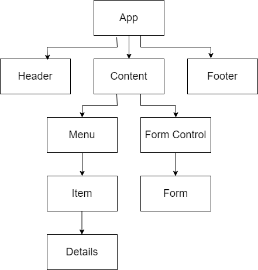

# _Coffee Shop_

#### By _**Thomas Bakken**_

#### _A react app for managing a coffee shop's inventory._

## Technologies Used

* _React.js_
* _Node.js_
* _Javascipt_
* _Html_
* _CSS_

## Description

_This react application is for tracking the inventory of coffee for a shop. The user can add a new bulk bag of beans. The user can view the current inventory. The user can reduce the quantity of beans in a bag for a sale. The user can delete a bag of beans._

## Setup/Installation Requirements

* _Node Setup_
  * _Download and install Node.js_
  * _Verify compatibility with node version v18.16.0 and npm version 9.5.1_
* _Navigate to the root project directory_
* _Run the node server with bash command: $ npm start_

## Component Diagram

## Known Bugs

* Delete item function missing
* Format items on page

## License

_MIT_

Copyright (c) _9/10/2023_ _Thomas Bakken_